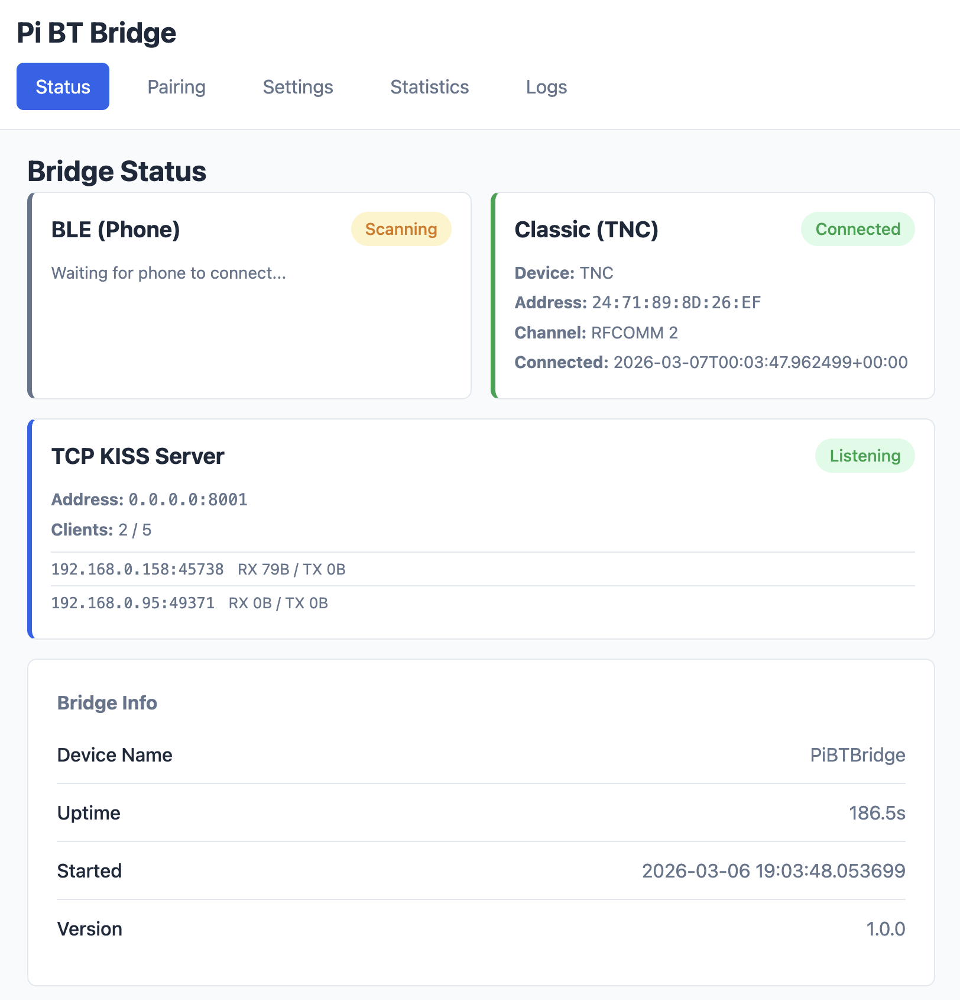

# Pi BT Bridge

A Bluetooth LE to Bluetooth Classic bridge daemon for Raspberry Pi Zero 2 W, designed to connect iOS ham radio apps and desktop APRS software to Bluetooth Classic TNC devices.

## Overview

Many ham radio TNC (Terminal Node Controller) devices use Bluetooth Classic Serial Port Profile (SPP) for connectivity. However, iOS devices only support Bluetooth Low Energy (BLE), not Bluetooth Classic, and desktop APRS apps need a network KISS TNC. This daemon bridges the gap by:

1. Advertising a BLE GATT service (Nordic UART Service) that iOS apps can connect to
2. Serving a TCP KISS port that desktop apps (Direwolf, APRSIS32, Xastir, PinPoint APRS) can connect to
3. Connecting to your TNC device over Bluetooth Classic SPP
4. Transparently forwarding KISS protocol frames between all connected clients and the TNC

```
┌─────────┐      BLE/NUS      ┌──────────────┐    BT Classic/SPP    ┌─────────┐
│  iPhone │ ◄───────────────► │              │ ◄─────────────────► │         │
│   App   │                   │  Raspberry   │                      │   TNC   │
└─────────┘                   │   Pi Zero    │                      │ Device  │
┌─────────┐    TCP KISS       │              │                      │         │
│ Desktop │ ◄───────────────► │              │                      │         │
│  Apps   │   (port 8001)     └──────────────┘                      └─────────┘
└─────────┘
```

Multiple clients can share the same radio simultaneously. For example, you can run APRS Chat on your iPhone via BLE while Direwolf and PinPoint APRS connect over TCP KISS -- all using the same TNC.

**Features:**

- **Multi-client radio sharing** -- BLE and TCP KISS clients share the same TNC
- **TCP KISS server** (port 8001) for Direwolf, APRSIS32, Xastir, PinPoint APRS, and other KISS-capable software
- **Web interface** for configuration, pairing, and monitoring
- **TNC history** for quick-switching between paired radios
- Auto-reconnection with exponential backoff
- Real-time status via Server-Sent Events (SSE)
- Systemd service for automatic startup

## Hardware Requirements

- **Raspberry Pi Zero 2 W** (recommended) or any Pi with Bluetooth
- Your Bluetooth Classic TNC device (e.g., Mobilinkd TNC3/TNC4, Kenwood TH-D74)

## Software Requirements

- Raspberry Pi OS (Bookworm or later recommended)
- Python 3.11+
- BlueZ 5.x (included with Raspberry Pi OS)

## Quick Start

### 1. Install

```bash
git clone https://github.com/hemna/pi-bt-bridge.git
cd pi-bt-bridge
sudo ./scripts/install.sh
```

### 2. Access Web Interface

Open a browser and navigate to:

```
http://<pi-ip-address>:8080
```

### 3. Pair Your TNC

1. Go to the **Pairing** page
2. Click "Scan for Devices"
3. Select your TNC and click "Pair"
4. Enter PIN if prompted (usually `0000`)
5. Click "Use as TNC" to set as target

### 4. Connect from iOS

1. Open your ham radio app (e.g., APRS.fi)
2. Go to Bluetooth settings
3. Connect to "PiBTBridge"

See [Installation Guide](docs/installation.md) for detailed instructions.

## Use Cases

### Share a single radio with multiple apps

Connect your TNC once and use it from multiple devices simultaneously:

- **APRS Chat on iPhone** (via BLE) + **Direwolf on laptop** (via TCP KISS) -- both using the same radio
- **PinPoint APRS** + **APRSIS32** + **Xastir** -- all connected via TCP KISS on port 8001
- **Mobile in the field**: iPhone app via BLE while a laptop runs Direwolf for digipeating

### Bridge iOS to Bluetooth Classic TNCs

iOS does not support Bluetooth Classic. The Pi acts as a transparent bridge so your iPhone ham radio apps work with any BT Classic TNC (Mobilinkd TNC3/TNC4, Kenwood TH-D74, etc).

### Network-enable a Bluetooth TNC

Turn any Bluetooth TNC into a network-accessible KISS TNC. Any software on your LAN that speaks KISS-over-TCP can connect to `<pi-ip>:8001` without needing Bluetooth on the client machine at all.

## Web Interface

Pi BT Bridge includes a built-in web interface for easy management.



| Page | Description |
|------|-------------|
| **Status** | Real-time connection status and bridge info |
| **Pairing** | Scan for and pair with Bluetooth devices |
| **Settings** | Configure device name, target TNC, logging |
| **Statistics** | View packet counts and throughput |

See [Web Interface Guide](docs/web-interface.md) for details.

## Configuration

Edit `/etc/bt-bridge/config.json` or use the web interface Settings page.

| Option | Default | Description |
|--------|---------|-------------|
| `target_address` | (required) | TNC Bluetooth MAC address |
| `device_name` | `"PiBTBridge"` | BLE name shown on iPhone |
| `rfcomm_channel` | `2` | RFCOMM channel (1-30) |
| `web_port` | `8080` | Web interface port |
| `log_level` | `"INFO"` | DEBUG, INFO, WARNING, ERROR |
| `tcp_kiss_enabled` | `true` | Enable TCP KISS server for desktop apps |
| `tcp_kiss_port` | `8001` | TCP KISS listening port |
| `tcp_kiss_max_clients` | `5` | Maximum simultaneous TCP KISS connections |

See [Configuration Reference](docs/configuration.md) for all options.

## Usage

### Systemd Service

```bash
# Start/stop/restart
sudo systemctl start bt-bridge
sudo systemctl stop bt-bridge
sudo systemctl restart bt-bridge

# View logs
sudo journalctl -u bt-bridge -f

# Enable on boot
sudo systemctl enable bt-bridge
```

### Running Manually

```bash
sudo python3 -m src.main

# With custom config
BT_BRIDGE_CONFIG=/path/to/config.json sudo python3 -m src.main
```

## Troubleshooting

### Bridge won't start

```bash
# Check Bluetooth adapter
sudo hciconfig hci0 up
sudo rfkill unblock bluetooth

# Check logs
sudo journalctl -u bt-bridge -n 50
```

### Can't connect to TNC

```bash
# Verify TNC is paired
bluetoothctl info 00:11:22:33:44:55

# Check RFCOMM channel
sdptool browse 00:11:22:33:44:55
```

### iPhone can't see the bridge

```bash
# Check BLE advertising
sudo btmgmt info

# Check logs for BLE errors
sudo journalctl -u bt-bridge | grep -i ble
```

## Development

```bash
# Clone and setup
git clone https://github.com/hemna/pi-bt-bridge.git
cd pi-bt-bridge
python3 -m venv venv
source venv/bin/activate
pip install -e ".[dev]"

# Run tests
pytest

# Deploy to Pi
make deploy PI_HOST=pi@raspberrypi.local
```

See [Development Guide](docs/development.md) for make targets and workflows.

## Architecture

```
src/
├── main.py                 # Daemon entry point
├── config.py               # Configuration management
├── models/
│   ├── state.py            # ConnectionState, BridgeState
│   ├── kiss.py             # KISS protocol parser
│   ├── hdlc.py             # HDLC protocol translation
│   ├── connection.py       # Connection tracking (BLE, Classic, TCP)
│   └── tnc_history.py      # TNC device history management
├── services/
│   ├── ble_service.py      # BLE GATT server (Nordic UART)
│   ├── classic_service.py  # BT Classic SPP client
│   ├── bridge.py           # Multi-client frame forwarding
│   ├── tcp_kiss_service.py # TCP KISS server for desktop apps
│   ├── pairing_agent.py    # D-Bus pairing agent
│   ├── scanner_service.py  # Bluetooth device scanner
│   └── web_service.py      # Web interface (aiohttp)
└── web/
    ├── models.py           # Web data models
    ├── templates/          # Jinja2 HTML templates
    └── static/             # CSS styles
```

## Protocol Details

### BLE Service (Nordic UART Service)

| UUID | Description |
|------|-------------|
| `6E400001-B5A3-F393-E0A9-E50E24DCCA9E` | Service UUID |
| `6E400002-B5A3-F393-E0A9-E50E24DCCA9E` | TX Characteristic (write) |
| `6E400003-B5A3-F393-E0A9-E50E24DCCA9E` | RX Characteristic (notify) |

### TCP KISS Server

The TCP KISS server (default port 8001) speaks standard KISS-over-TCP, compatible with any software that supports a network KISS TNC:

| Software | Connection String |
|----------|-------------------|
| Direwolf | `kissutil -p <pi-ip>:8001` |
| APRSIS32 | KISS TNC, host `<pi-ip>`, port `8001` |
| Xastir | Network KISS TNC, `<pi-ip>:8001` |
| PinPoint APRS | KISS TCP, `<pi-ip>:8001` |
| Pat (Winlink) | `tcp://<pi-ip>:8001` |

Multiple TCP clients can connect simultaneously (up to `tcp_kiss_max_clients`, default 5). All clients and the BLE connection share the same radio -- received frames are broadcast to all connected clients, and any client can transmit.

### KISS Protocol

The bridge transparently forwards KISS frames:

- Frame delimiter: `0xC0` (FEND)
- Escape character: `0xDB` (FESC)
- Escaped FEND: `0xDB 0xDC`
- Escaped FESC: `0xDB 0xDD`

## Documentation

| Document | Description |
|----------|-------------|
| [Installation Guide](docs/installation.md) | Detailed installation instructions |
| [Configuration Reference](docs/configuration.md) | All configuration options |
| [Web Interface Guide](docs/web-interface.md) | Using the web UI |
| [API Reference](docs/api.md) | REST API documentation |
| [Development Guide](docs/development.md) | Development workflow |

## License

MIT License - See LICENSE file for details.

## Contributing

Contributions are welcome! Please:

1. Fork the repository
2. Create a feature branch
3. Write tests for new functionality
4. Ensure tests pass and linting is clean
5. Submit a pull request

## Acknowledgments

- [bless](https://github.com/kevincar/bless) - BLE GATT server library
- [BlueZ](http://www.bluez.org/) - Linux Bluetooth stack
- Nordic Semiconductor for the UART Service specification
