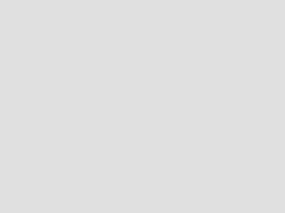
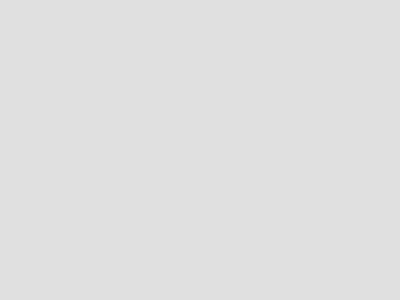

# Web Interface Guide

Pi BT Bridge includes a built-in web interface for monitoring, configuration, and Bluetooth device pairing.

## Overview

The web interface provides:

- **Real-time status monitoring** of BLE and Classic Bluetooth connections
- **Device pairing** wizard for discovering and pairing with TNC devices
- **Configuration management** without editing files manually
- **Statistics and diagnostics** for troubleshooting

## Accessing the Interface

Once the daemon is running, access the web interface at:

```
http://<pi-ip-address>:8080
```

For example:
- `http://192.168.1.100:8080`
- `http://raspberrypi.local:8080`

The default port is `8080`. See [Configuration](configuration.md) to change it.

## Pages

### Status Page (/)

The main dashboard showing the current state of the bridge.


**Features:**

| Section | Description |
|---------|-------------|
| **BLE Connection** | Shows phone/app connection status, device name, MAC address, and connection time |
| **Classic Connection** | Shows TNC connection status, target device, RFCOMM channel, and connection time |
| **Bridge Info** | Displays device name, uptime, start time, and version |
| **Status Alerts** | Green alert when bridge is active (both sides connected), warning when disconnected |

**Real-time Updates:**

The status page uses Server-Sent Events (SSE) to update automatically when connection states change. The uptime counter increments every second.

---

### Pairing Page (/pairing)

Discover and pair with Bluetooth Classic TNC devices.


**Workflow:**

1. **Scan for Devices**
   - Click "Scan for Devices" to start Bluetooth discovery
   - Scanning takes approximately 10-15 seconds
   - Discovered devices appear in a list

2. **Review Discovered Devices**
   - Each device shows:
     - Device name (or "Unknown Device")
     - MAC address
     - Signal strength (RSSI in dBm)
     - "SPP" badge if device supports Serial Port Profile
     - "Paired" badge if already paired

3. **Pair with Device**
   - Click "Pair" next to an unpaired device
   - If a PIN is required, a PIN entry form appears
   - Enter the PIN (usually `0000` or `1234`) and submit

4. **Set as Target TNC**
   - After successful pairing, click "Use as TNC"
   - This updates the configuration and saves automatically
   - A confirmation dialog ensures you want to change the target

**Current Target Section:**

Displays the currently configured target TNC address and RFCOMM channel.

---

### Settings Page (/settings)

Configure bridge settings through a web form.



**Configuration Options:**

| Field | Description | Validation |
|-------|-------------|------------|
| **Device Name** | BLE advertised name | 1-20 alphanumeric characters, hyphens allowed |
| **Target TNC Address** | Bluetooth MAC address | Must be valid MAC format (XX:XX:XX:XX:XX:XX) |
| **RFCOMM Channel** | SPP channel number | 1-30 |
| **Log Level** | Logging verbosity | DEBUG, INFO, WARNING, ERROR |
| **HTTP Port** | Web interface port | 1024-65535 |

**Actions:**

| Button | Description |
|--------|-------------|
| **Save Settings** | Validates and saves configuration to file |
| **Restart Bridge** | Restarts the daemon (required for some changes like port) |

**Feedback:**

- Success messages show when settings are saved
- Validation errors are displayed per field
- A notice indicates if restart is required

---

### Statistics Page (/stats)

View packet statistics and throughput metrics.



**Metrics:**

| Metric | Description |
|--------|-------------|
| **Frames Bridged** | Total KISS frames forwarded between connections |
| **Bytes to TNC** | Total bytes sent to the TNC device |
| **Bytes from TNC** | Total bytes received from the TNC device |
| **Errors** | Error count (highlighted red if > 0) |
| **Total Throughput** | Combined bytes transferred |
| **Average Rate** | Calculated bytes per second |

**Connection Status:**

Shows current BLE and Classic connection states with color-coded badges.

**Auto-Refresh:**

Statistics automatically refresh every 5 seconds. Use the "Refresh" button for immediate update.

## Real-time Updates

The web interface uses **Server-Sent Events (SSE)** for real-time updates without page refresh.

### How it Works

1. Browser opens persistent connection to `/api/status/stream`
2. Server pushes status updates when connection states change
3. JavaScript updates the page elements automatically

### Limitations

- Maximum 5 concurrent SSE clients (additional clients receive HTTP 503)
- Connection sends a ping every 30 seconds to stay alive

## Mobile Responsiveness

The web interface is designed to work on mobile devices:

- **Single-column layout** on narrow screens
- **Touch-friendly** buttons and inputs
- **Readable fonts** sized for mobile
- **Card-based design** that stacks vertically

Access the interface from your phone's browser to manage the bridge remotely.

## Navigation

All pages share a common navigation header:

| Link | Page |
|------|------|
| Status | Main dashboard (/) |
| Pairing | Device pairing (/pairing) |
| Settings | Configuration (/settings) |
| Statistics | Packet stats (/stats) |

The current page is highlighted in the navigation bar.

## Disabling the Web Interface

If you don't need the web interface, disable it in your configuration:

```json
{
  "web_enabled": false
}
```

This reduces resource usage and eliminates the HTTP server.

## Security Considerations

The web interface has **no authentication** and is intended for use on a trusted local network only.

**Recommendations:**

- Don't expose port 8080 to the internet
- Use firewall rules to restrict access if needed
- Bind to localhost only if remote access isn't needed:
  ```json
  {
    "web_host": "127.0.0.1"
  }
  ```

## Troubleshooting

### Can't access web interface

```bash
# Check if daemon is running
sudo systemctl status bt-bridge

# Check if web interface is enabled in config
grep web_enabled /etc/bt-bridge/config.json

# Check which port it's listening on
sudo ss -tlnp | grep python
```

### Page shows stale data

- Check browser console for SSE connection errors
- Verify maximum clients (5) hasn't been reached
- Try refreshing the page

### Settings won't save

- Check file permissions on `/etc/bt-bridge/config.json`
- Look for validation error messages on the page
- Check daemon logs: `sudo journalctl -u bt-bridge -n 20`

## See Also

- [API Reference](api.md) - REST API documentation
- [Configuration Reference](configuration.md) - All configuration options
- [Installation Guide](installation.md) - Setup instructions
